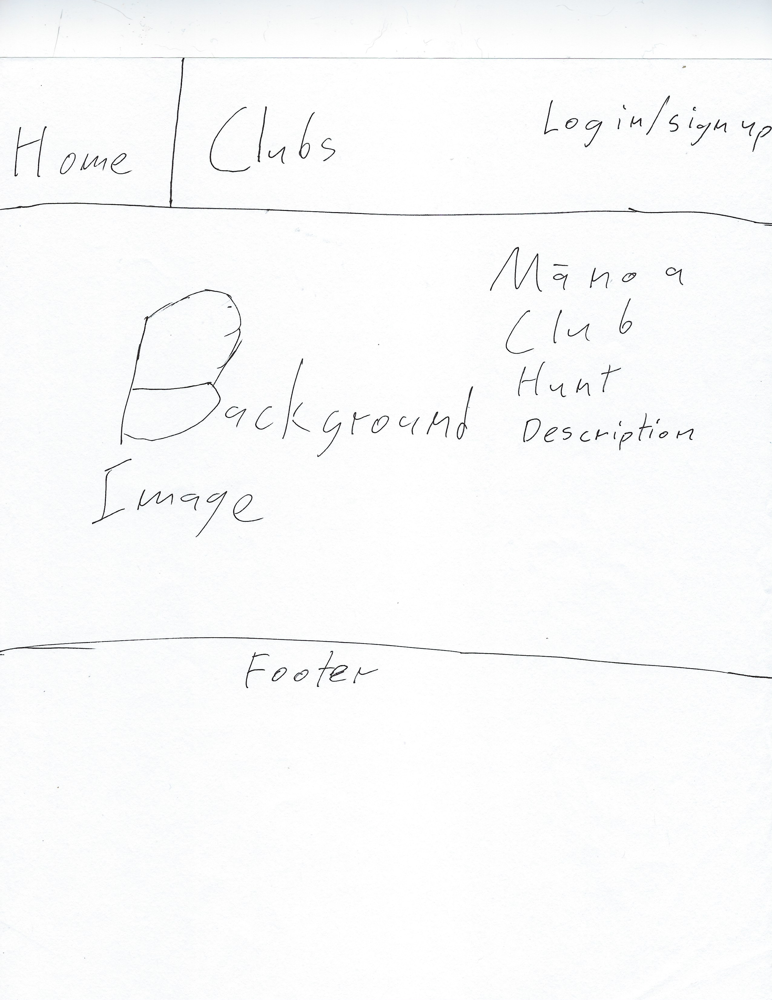
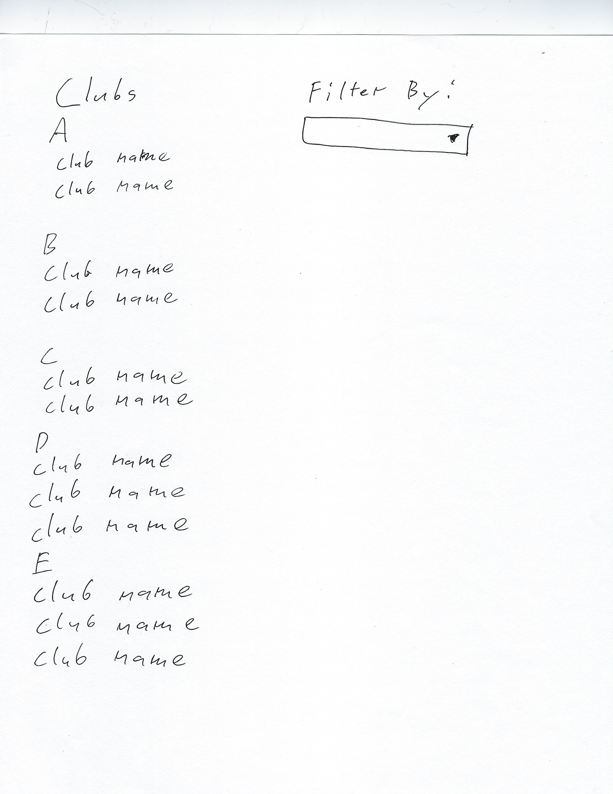
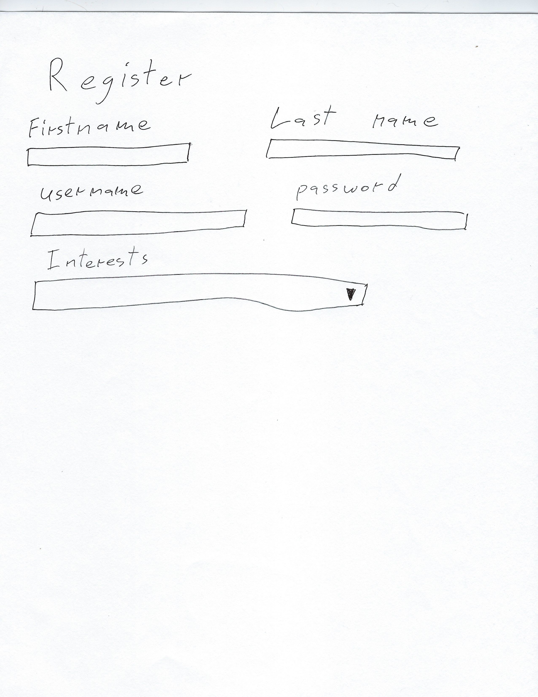
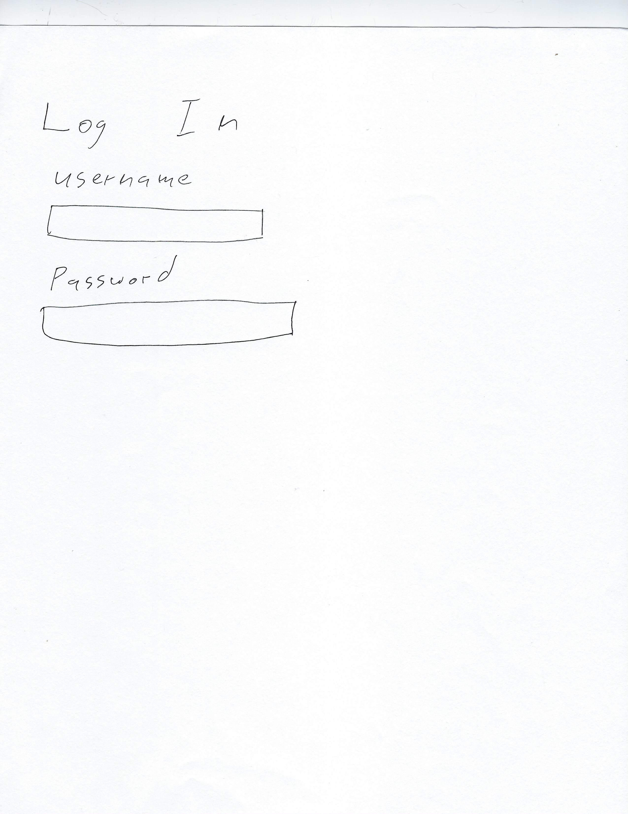
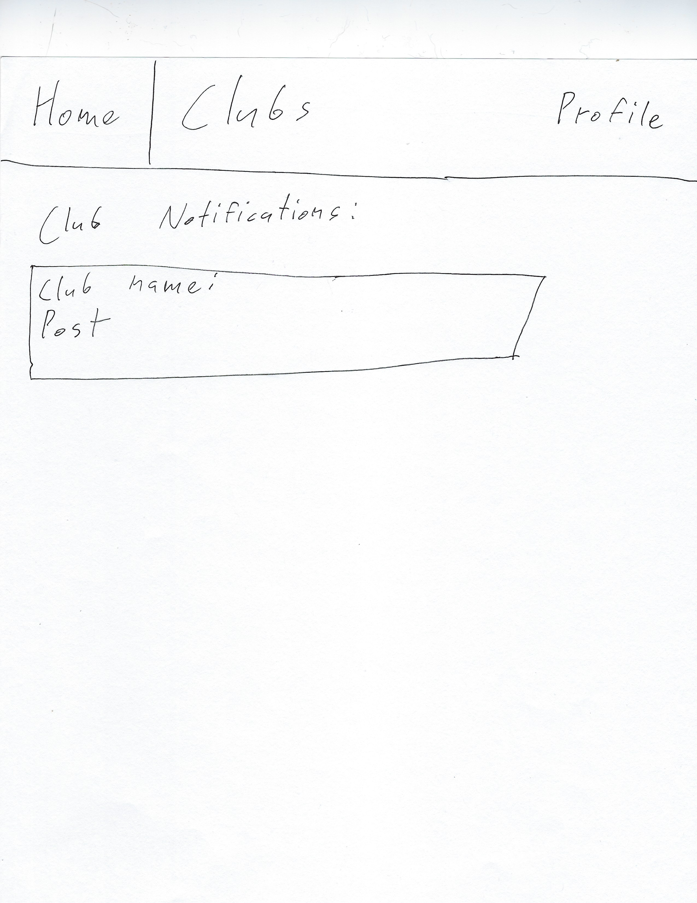
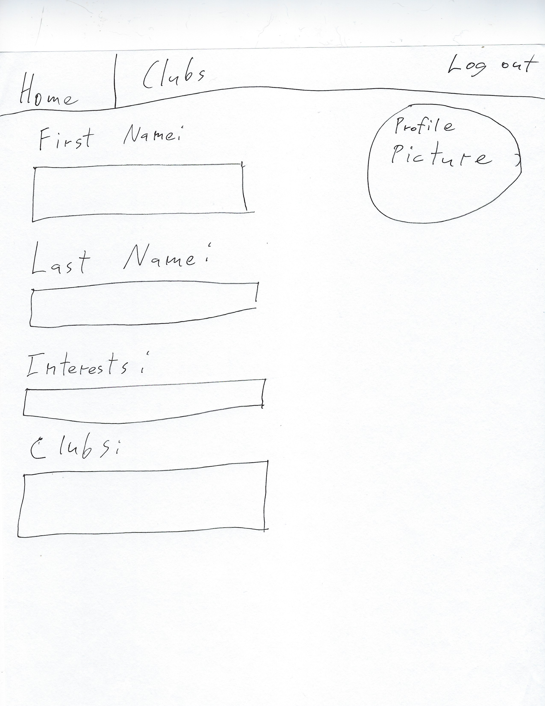
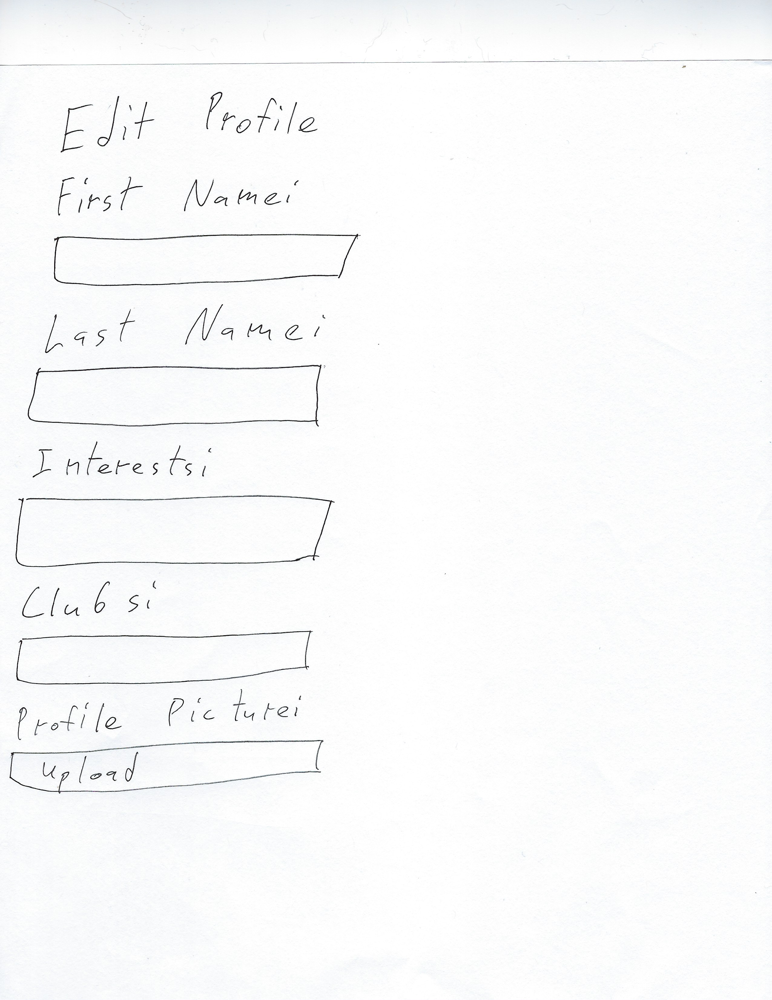
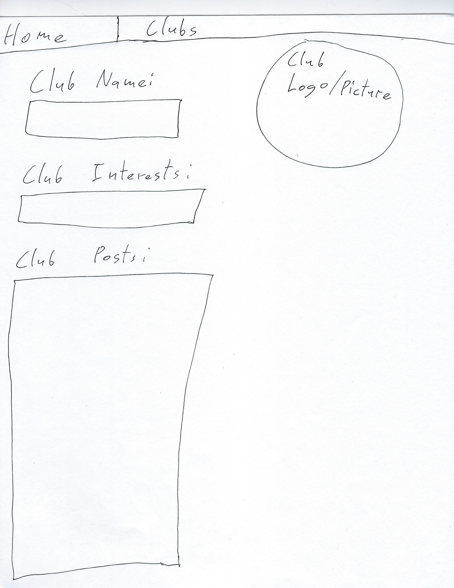
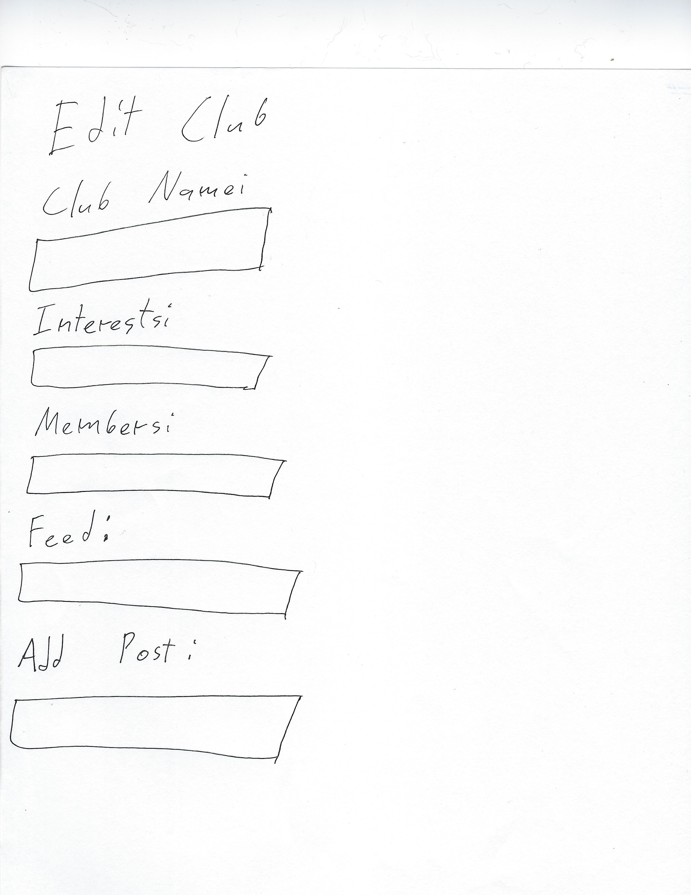
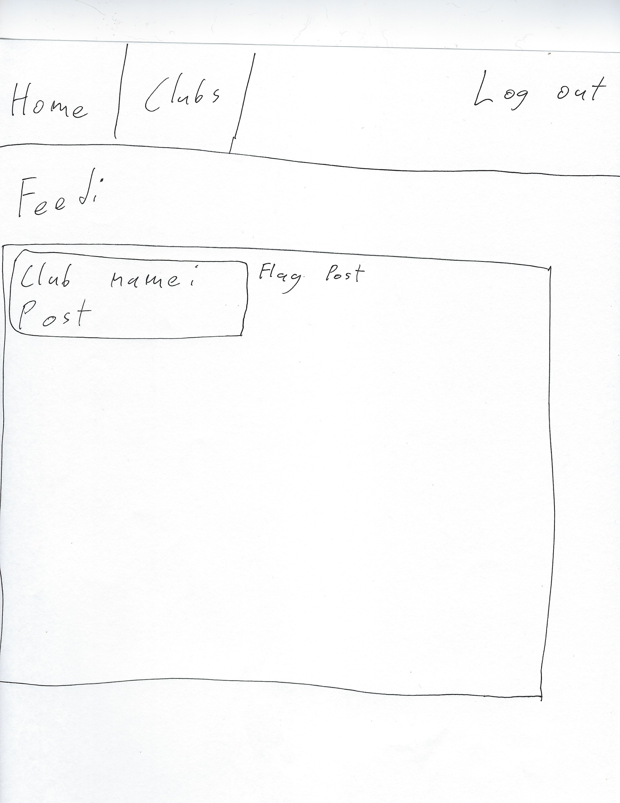

## Table of contents

* [Overview](#overview)
* [Milestones](#milestones)
* [Advanced Features](#advanced-features)
* [Page Mockups](#page-mockups)
* [Team Members](#team-members)

## Overview
_The problem:_ UH Mānoa has hundreds of active clubs. However, it can be difficult for new students to find information about potential clubs they want to join. 

_The solution:_ Mānoa Club Hunt will provide students with a directory of clubs containing club information, club meeting location and times, club website links, and club contact information. 
Users will be able to join clubs and receive notifications about the club.
Clubs will be able to send out notifications to their club members through Mānoa Club Hunt. 

## Milestones
### Milestone 1
For Milestone 1 our group created mockup pages for our application. Excluding edit pages, these pages are:
* Landing page
* List club page
* Create club page
* User profile page
* Club profile page

Current functionality allows a user to create an account and browse for clubs to join. User can also create a club that gets added to the club list. The club list is sorted in alphabetical order. User can enter information about themselves on the user profile page and club profile page displays all relevant information about the club. 

Link to Milestone 1 page [here](https://github.com/manoa-club-hunt/manoa-club-hunt/projects/1).

### Milestone 2
For Milestone 2 our group will continue to add functionality to the application and improve visuals. Functionality improvements:
* Filter clubs by interests
* User can join clubs
* Site admin can delete clubs

Link to Milestone 2 page [here](https://github.com/manoa-club-hunt/manoa-club-hunt/projects/2).

## Advanced Features
* Filter System: User is able to filter clubs by preferences such as trending, order, popularity, etc.
* Club Registration: Clubs can add, update, and remove themselves from the system. Here they can also post their home pages, descriptions, contact information, locations, and time schedule.
* Search Bar: One can use the search bar to look for names of clubs.
* Rating System: Users can rate the clubs.
* Mark System: Users can mark any clubs they are interested in.
* Recommendation System: Users can be recommended clubs based on their interests.

## Page Mockups

### Landing Page:

### List Clubs Page:

### Register Page:

### Login Page:

### User Home Page:

### User Profile Page:

### Edit User Page:

### Club Profile Page:

### Edit Club Page:

### Site Admin Page: 

## Team Members:
* [Konapiliahi Canaday](https://k-canaday.github.io/), Computer Engineering
* [Xandrew Julian](https://xandrewuh.github.io/), Computer Engineering
* [Ioane Omerod](https://ioaneomerod.github.io/), Computer Science
* [Sun Young Kim](https://sunyoungk.github.io/), Computer Science
