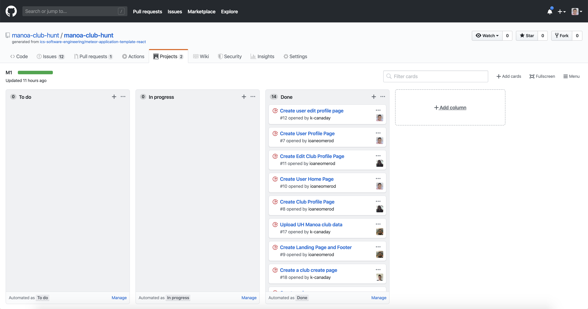

## Table of contents

* [Overview](#overview)
* [Github Organization Link](https://github.com/manoa-club-hunt)
* [Galaxy Deployment Link](http://manoa-club-hunt.meteorapp.com/)
* [User Guide](#user-guide)
* [Development History](#development-history)
* [Team Members](#team-members)

## Overview
_The problem:_ UH Mānoa has hundreds of active clubs. However, it can be difficult for new students to find information about potential clubs they want to join. 

_The solution:_ Mānoa Club Hunt will provide students with a directory of clubs containing club information, club meeting location and times, club website links, and club contact information. 
Users will be able to join clubs and receive notifications about the club.
Clubs will be able to send out notifications to their club members through Mānoa Club Hunt. 

## User Guide

### Landing Page:

The landing page is the first page presented to users and gives a brief description of our application.

### Register Page:

Click on "Login" in the top right of the page and select "Sign Up" to register if you are a new user.

### Login Page:

Click on "Sign In" above "Sign Up" to log in if you are an already registered user. 

### User Home Page:

After logging in, click on "Home" to be directed to a user home page.

### User Profile Page:

After logging in, click on your email in the top right of the navbar and then click on "Your Profile" to go to the user profile page that shows all of the data associated with your profile.

### List Clubs Page:

The List Clubs page shows all of the clubs currently in our system sorted alphabetically.

### Club Profile Page:

While logged in, you can click on the "View Profile" link on clubs in the List Clubs page to show a profile that displays data associated with the club.

### Edit Club Page:

While logged in, you can click on "Edit Club" on any club profile to be directed to a form that allows you to change the data associated with the club.

### Add Club Page:

While logged in, you can click on "Add Club" to go to a page that allows you to fill out a form that will create a new club in our system.

## Development History
### Milestone 1
For Milestone 1 our group created mockup pages for our application. Excluding edit pages, these pages are:
* Landing page
* List club page
* Create club page
* Club profile page
* User home page
* User profile page

Current functionality allows a user to create an account and browse for clubs to join. User can also create a club that gets added to the club list. The club list is sorted in alphabetical order. The club profile page displays all relevant information about the club selected. We also added in 100 club listings from the official UH Manoa club list. 

Here is the [Milestone 1 Project Board](https://github.com/manoa-club-hunt/manoa-club-hunt/projects/1):

### Milestone 2
For Milestone 2 our group will continue to add functionality to the application and improve visuals. Improvements:
* Finish implementing user profile page
* Filter clubs by interests
* Add pagination to club listings
* User can join clubs
* Site admin can delete clubs
* Add next 100 clubs from official UH Manoa club list
* Able to delete club listings
* User profile page will display clubs user is member of

Here is the [Milestone 2 Project Board](https://github.com/manoa-club-hunt/manoa-club-hunt/projects/2).

## Team Members:
* [Konapiliahi Canaday](https://k-canaday.github.io/), Computer Engineering
* [Xandrew Julian](https://xandrewuh.github.io/), Computer Engineering
* [Ioane Omerod](https://ioaneomerod.github.io/), Computer Science
* [Sun Young Kim](https://sunyoungk.github.io/), Computer Science
