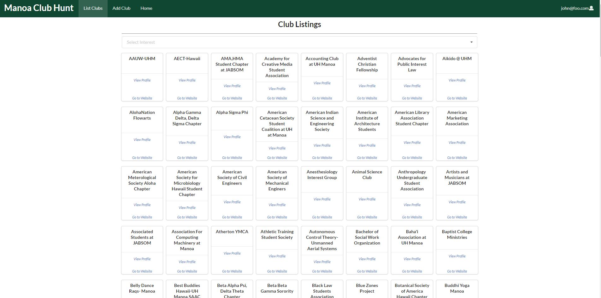
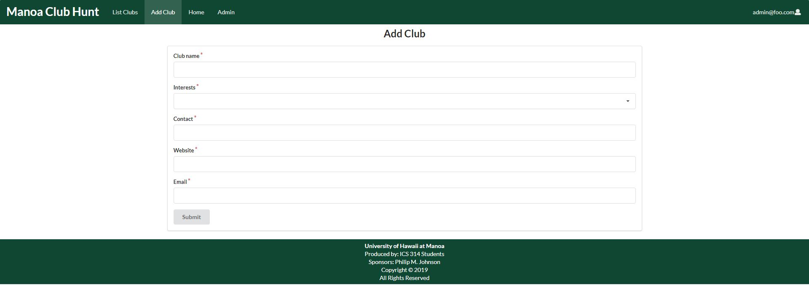

## Table of contents

* [Overview](#overview)
* [Milestones](#milestones)
* [Advanced Features](#advanced-features)
* [Page Mockups](#page-mockups)
* [Team Members](#team-members)

## Overview
_The problem:_ UH Mānoa has hundreds of active clubs. However, it can be difficult for new students to find information about potential clubs they want to join. 

_The solution:_ Mānoa Club Hunt will provide students with a directory of clubs containing club information, club meeting location and times, club website links, and club contact information. 
Users will be able to join clubs and receive notifications about the club.
Clubs will be able to send out notifications to their club members through Mānoa Club Hunt. 

_Link to GitHub Organization [here](https://github.com/manoa-club-hunt)_.

_Link to Galaxy deployment [here](http://manoa-club-hunt.meteorapp.com/)_.

## Milestones
### Milestone 1
For Milestone 1 our group created mockup pages for our application. Excluding edit pages, these pages are:
* Landing page
* List club page
* Create club page
* Club profile page
* User home page

Current functionality allows a user to create an account and browse for clubs to join. User can also create a club that gets added to the club list. The club list is sorted in alphabetical order. The club profile page displays all relevant information about the club selected. We also added in 100 club listings from the official UH Manoa club list. 

Link to Milestone 1 page [here](https://github.com/manoa-club-hunt/manoa-club-hunt/projects/1).

### Milestone 2
For Milestone 2 our group will continue to add functionality to the application and improve visuals. Improvements:
* Finish implementing user profile page
* Filter clubs by interests
* Add pagination to club listings
* User can join clubs
* Site admin can delete clubs
* Add next 100 clubs from official UH Manoa club list
* Able to delete club listings
* User profile page will display clubs user is member of

Link to Milestone 2 page [here](https://github.com/manoa-club-hunt/manoa-club-hunt/projects/2).

## Page Mockups

### Landing Page:

### Register Page:

### Login Page:

### User Home Page:

### User Profile Page:

### List Clubs Page:

### Club Profile Page:

### Add Club Page:

### Edit Club Page:

## Team Members:
* [Konapiliahi Canaday](https://k-canaday.github.io/), Computer Engineering
* [Xandrew Julian](https://xandrewuh.github.io/), Computer Engineering
* [Ioane Omerod](https://ioaneomerod.github.io/), Computer Science
* [Sun Young Kim](https://sunyoungk.github.io/), Computer Science
