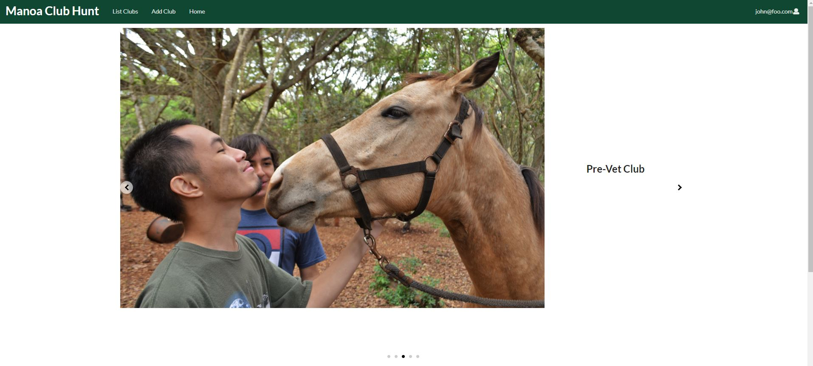
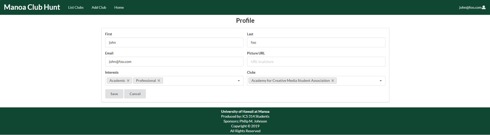

## Table of contents

* [Overview](#overview)
* [Github Organization Link](https://github.com/manoa-club-hunt)
* [Galaxy Deployment Link](http://manoa-club-hunt.meteorapp.com/)
* [Milestone 1 Link](https://github.com/manoa-club-hunt/manoa-club-hunt/projects/1)
* [Milestone 2 Link](https://github.com/manoa-club-hunt/manoa-club-hunt/projects/2)
* [Milestone 3 Link](https://github.com/manoa-club-hunt/manoa-club-hunt/projects/3)
* [User Guide](#user-guide)
* [Developer Guide](#developer-guide)
* [Team Members](#team-members)

## Overview
_The problem:_ UH Mānoa has hundreds of active clubs. However, it can be difficult for new students to find information about potential clubs they want to join. 

_The solution:_ Mānoa Club Hunt will provide students with a directory of clubs containing club information, club meeting location and times, club website links, and club contact information. 
Users will be able to join clubs and receive notifications about the club.
Clubs will be able to send out notifications to their club members through Mānoa Club Hunt. 

## User Guide

### Landing Page:

The [Landing Page](http://manoa-club-hunt.meteorapp.com/#/) is the first page presented to users and gives a brief description of our application.


### Login Page:

Clicking on "Login" in the top right corner of the page and then "Sign In" brings up the [Login Page](http://manoa-club-hunt.meteorapp.com/#/signin). Login if you are already a registered user.


### Register Page:

Clicking on "Login" in the top right corner of the page and then "Sign Up" brings up the [Register Page](http://manoa-club-hunt.meteorapp.com/#/signup). Sign up if you are a new user.


### Landing (after Login) Page:

Once you log in (either to an existing account or by creating a new one), the navbar changes as follows:



### User Home Page:

After logging in, click on "Home" to be directed to the [User Home Page](http://manoa-club-hunt.meteorapp.com/#/userprofile).


### User Profile Page:

After logging in, click on the user icon in the top right of the navbar then click on "Your Profile". You will go to the [User Profile Page](http://manoa-club-hunt.meteorapp.com/#/userprofile) that shows all of the data associated with your profile.


### Edit User Profile Page:

After logging in, and going to your profile page click on the "Edit Profile" button to go to the [Edit User Profile Page](http://manoa-club-hunt.meteorapp.com/#/edituserprofile). This page allows you to edit your user profile.



### List Clubs Page:

The [List Clubs Page](http://manoa-club-hunt.meteorapp.com/#/list) shows all of the clubs currently in the system sorted alphabetically. Each club has a website link and club profile link. This page also features a dropdown bar that allows you to filter clubs based on their interest fields. 

Clubs sorted by "Academic" interst field:


### Club Profile Page:

Clicking on the "View Profile" link for a club takes you to the club's profile page that displays information about the club. For example, here is [AAUW-UHM's Club Profile](http://manoa-clubhunt.meteorapp.com/#/clubPage/85fq9K3x9YXqoJgTQ).


### Edit Club Page:

While logged in, you can click on "Edit Club" on the club profile page to go to the edit club page. This page allows you to edit the data associated with the club. For example, here is the [Edit Club Page for AAUW-UHM](http://manoa-club-hunt.meteorapp.com/#/edit/85fq9K3x9YXqoJgTQ).


### Add Club Page:

While logged in, you can click on "Add Club" to go to the [Add Club Page](http://manoa-club-hunt.meteorapp.com/#/add) that allows you to add a club to the system.


## Developer Guide

First, [install Meteor](https://www.meteor.com/install).

Second, go to [https://github.com/manoa-club-hunt/manoa-club-hunt](https://github.com/manoa-club-hunt/manoa-club-hunt), and click the "Clone or download" button to download the GitHub repo to your local file system. Using [GitHub Desktop](https://desktop.github.com/) is the preferred method if you use MacOS or Windows.

Third, cd into the app/ directory of your local copy of the repo, and install third party libraries with:

```
$ meteor npm install

$ npm install react-slideshow-image -S
```

### Running the system

Once the libraries are installed, you can run the application by invoking the "start" script in the [package.json file](https://github.com/manoa-club-hunt/manoa-club-hunt/blob/master/app/package.json):

```
$ meteor npm run start
```

The first time you run the application, it will create some default users, default user profiles, and club data. Here is the output:

```
C:\Users\konat\Desktop\github\manoa-club-hunt\app>meteor npm run start

> meteor-application-template-react@ start C:\Users\konat\Desktop\github\manoa-club-hunt\app
> meteor --no-release-check --settings ../config/settings.development.json

[[[[[ C:\Users\konat\Desktop\github\manoa-club-hunt\app ]]]]]

=> Started proxy.
=> Started MongoDB.
W20191204-02:14:39.609(-10)? (STDERR) Note: you are using a pure-JavaScript implementation of bcrypt.
W20191204-02:14:40.551(-10)? (STDERR) While this implementation will work correctly, it is known to be
W20191204-02:14:40.552(-10)? (STDERR) approximately three times slower than the native implementation.
W20191204-02:14:40.556(-10)? (STDERR) In order to use the native implementation instead, run
W20191204-02:14:40.557(-10)? (STDERR)
W20191204-02:14:40.559(-10)? (STDERR)   meteor npm install --save bcrypt
W20191204-02:14:40.563(-10)? (STDERR)
W20191204-02:14:40.564(-10)? (STDERR) in the root directory of your application.
I20191204-02:14:41.321(-10)? Creating the default user(s)
I20191204-02:14:41.323(-10)?   Creating user: email->admin@foo.com, firstname->admin, lastname->foo.
I20191204-02:14:41.629(-10)?   Creating user: email->john@foo.com, firstname->john, lastname->foo.
I20191204-02:14:41.897(-10)? Creating default clubs.
I20191204-02:14:41.899(-10)?    Adding: Academy for Creative Media Student Association
I20191204-02:14:41.946(-10)?    Adding: Accounting Club at UH Manoa
I20191204-02:14:41.954(-10)?    Adding: Adventist Christian Fellowship
I20191204-02:14:41.964(-10)?    Adding: Advocates for Public Interest Law
I20191204-02:14:41.977(-10)?    Adding: AAUW-UHM
.
.
.
I20191204-02:14:43.692(-10)?    Adding: Women's Interest Group at JABSOM
I20191204-02:14:43.700(-10)?    Adding: Younglife
I20191204-02:14:43.709(-10)? Creating default user profiles.
I20191204-02:14:43.710(-10)?    Adding: admin foo
I20191204-02:14:43.732(-10)?    Adding: john foo
=> Started your app.

=> App running at: http://localhost:3000/
   Type Control-C twice to stop.
```

### Note regarding the "bcrypt warning":

You will also get the following message when you run this application:

```
Note: you are using a pure-JavaScript implementation of bcrypt.
While this implementation will work correctly, it is known to be
approximately three times slower than the native implementation.
In order to use the native implementation instead, run

  meteor npm install --save bcrypt

in the root directory of your application.
```

On some operating systems (particularly Windows), installing bcrypt is much more difficult than implied by the above message. Bcrypt is only used in Meteor for password checking, so the performance implications are negligible until your site has very high traffic. You can safely ignore this warning without any problems during initial stages of development.

### Viewing the running app

If all goes well, the Manoa Club Hunt application will appear at [http://localhost:3000](http://localhost:3000). You can login using the credentials in [settings.development.json](https://github.com/manoa-club-hunt/manoa-club-hunt/blob/master/config/settings.development.json), or else register a new account.

## Team Members:
* [Konapiliahi Canaday](https://k-canaday.github.io/), Computer Engineering
* [Xandrew Julian](https://xandrewuh.github.io/), Computer Engineering
* [Ioane Omerod](https://ioaneomerod.github.io/), Computer Science
* [Sun Young Kim](https://sunyoungk.github.io/), Computer Science
