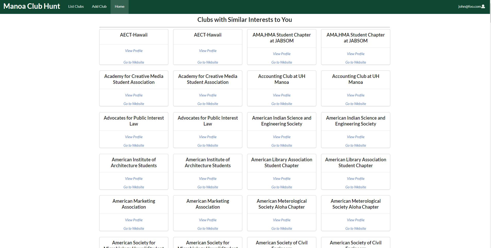

## Table of contents

* [Overview](#overview)
* [Github Organization Link](https://github.com/manoa-club-hunt)
* [Galaxy Deployment Link](http://manoa-club-hunt.meteorapp.com/)
* [Milestones](#milestones)
* [User Guide](#user-guide)
* [Developer Guide](#developer-guide)
* [Team Members](#team-members)

## Overview
_The problem:_ UH Mānoa has hundreds of active clubs. However, it can be difficult for new students to find information about potential clubs they want to join. 

_The solution:_ Mānoa Club Hunt will provide students with a directory of clubs containing club information, club meeting location and times, club website links, and club contact information. 
Users will be able to join clubs and receive notifications about the club.
Clubs will be able to send out notifications to their club members through Mānoa Club Hunt. 

## Milestones
Milestone 1 project page [here](https://github.com/manoa-club-hunt/manoa-club-hunt/projects/1).

Milestone 2 project page [here](https://github.com/manoa-club-hunt/manoa-club-hunt/projects/2).

Milestone 3 project page [here](https://github.com/manoa-club-hunt/manoa-club-hunt/projects/3).

## User Guide

### Landing Page:

The [Landing Page](http://manoa-club-hunt.meteorapp.com/#/) is the first page presented to users and gives a brief description of our application.


### Register Page:

Clicking on "Login" in the top right corner of the page and then "Sign Up" brings up the [Register Page](http://manoa-club-hunt.meteorapp.com/#/signup) to register if you are a new user.


### Login Page:

Clicking on "Login" in the top right corner of the page and then "Sign In" brings up the [Login Page](http://manoa-club-hunt.meteorapp.com/#/signin) to login if you are already a registered user.


### User Home Page:

After logging in, click on "Home" to be directed to the [User Home Page](http://manoa-club-hunt.meteorapp.com/#/userprofile).



### User Profile Page:

After logging in, click on your email in the top right of the navbar and then click on "Your Profile" to go to the [User Profile Page](http://manoa-club-hunt.meteorapp.com/#/userprofile) that shows all of the data associated with your profile.


### Edit User Profile Page:

After logging in, and going to your profile page click on the "Edit Profile" button to go to the [Edit User Profile Page](http://manoa-club-hunt.meteorapp.com/#/edituserprofile) that allows you to fill out a form to edit your profile.


### List Clubs Page:

The [List Clubs Page](http://manoa-club-hunt.meteorapp.com/#/list) shows all of the clubs currently in our system sorted alphabetically.


### Club Profile Page:

While logged in, you can click on the "View Profile" link on clubs in the List Clubs page to show a profile that displays data associated with the club. Here is [AAUW-UHM's Club Profile](http://manoa-club-hunt.meteorapp.com/#/clubPage/85fq9K3x9YXqoJgTQ).


### Edit Club Page:

While logged in, you can click on "Edit Club" on any club profile to be directed to a form that allows you to change the data associated with the club. Here is the [Edit Club Page for AAUW-UHM](http://manoa-club-hunt.meteorapp.com/#/edit/85fq9K3x9YXqoJgTQ).


### Add Club Page:

While logged in, you can click on "Add Club" to go to the [Add Club Page](http://manoa-club-hunt.meteorapp.com/#/add) that allows you to fill out a form that will create a new club in our system.


## Developer Guide

First, [install Meteor](https://www.meteor.com/install).

Second, go to [https://github.com/manoa-club-hunt/manoa-club-hunt](https://github.com/manoa-club-hunt/manoa-club-hunt), and click the "Clone or download" button to download the GitHub repo to your local file system. Using [GitHub Desktop](https://desktop.github.com/) is the preferred method if you use MacOS or Windows.

Third, cd into the app/ directory of your local copy of the repo, and install third party libraries with:
```
$ meteor npm install
```
add note to install slideshow code thing
### Running the system

### Note regarding the "bcrypt warning":

## Team Members:
* [Konapiliahi Canaday](https://k-canaday.github.io/), Computer Engineering
* [Xandrew Julian](https://xandrewuh.github.io/), Computer Engineering
* [Ioane Omerod](https://ioaneomerod.github.io/), Computer Science
* [Sun Young Kim](https://sunyoungk.github.io/), Computer Science
